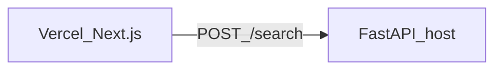

# Semantic search (portfolio stack)

Florida MLS listing descriptions → embeddings (sentence-transformers) → ChromaDB → **FastAPI**. A **Next.js** app on Vercel calls the API over HTTPS.

## Why two deployments?

Vercel runs the Next.js front end. **Chroma, PyTorch, and the embedding model do not run on Vercel serverless** in this setup. The Python API runs on any host that supports long-lived processes and enough RAM (Railway, Render, Fly.io, AWS App Runner, your laptop).



## Local development

### 1. Python dependencies

From repo root `machine_learning/`:

```bash
python -m pip install -r semantic_search/requirements.txt
```

### 2. Build the vector index (once, or after changing data/model)

```bash
python semantic_search/embed_listings.py --limit 200   # quick test
# or full dataset:
python semantic_search/embed_listings.py
```

This writes `semantic_search/chroma_data/`.

### 3. Run the API

```bash
cd /path/to/machine_learning
ALLOW_ORIGINS=http://localhost:3000 uvicorn semantic_search.server:app --reload --host 0.0.0.0 --port 8000
```

- `GET http://127.0.0.1:8000/health` — liveness and vector-store status  
- `POST http://127.0.0.1:8000/search` — JSON body `{"query":"...","k":5}`

### 4. Run the Next.js app

```bash
cd semantic_search/web
cp .env.local.example .env.local
npm install
npm run dev
```

Open [http://localhost:3000](http://localhost:3000). The default API URL in code is `http://127.0.0.1:8000`.

Shared search logic lives in `semantic_search/core.py`.

## Environment variables

- **FastAPI — `ALLOW_ORIGINS`:** comma-separated CORS origins, e.g. `http://localhost:3000,https://your-app.vercel.app`. Restart the API after changes.
- **FastAPI — `CHROMA_HTTP_URL` (optional, production):** `https://…` URL to a `.zip` of `semantic_search/chroma_data/` — used by `scripts/run_api.sh` on App Runner when the vector index is not in the repo (HTTP is rejected).
- **Build — `HF_TOKEN` (optional):** Hugging Face token for higher rate limits when the App Runner **build** step downloads the sentence-transformers model. Set in the App Runner service **Build** environment (not in git).
- **FastAPI — `PORT`:** listen port; App Runner and many PaaS set this automatically.
- **Next.js (`.env.local`) — `NEXT_PUBLIC_SEARCH_API_URL`:** API base URL, no trailing slash, e.g. `https://api.example.com`.
- **Vercel project settings — `NEXT_PUBLIC_SEARCH_API_URL`:** same value, pointing at your deployed FastAPI HTTPS URL.

## Deploy Next.js to Vercel

1. Connect the Git repo to Vercel.  
2. Set **Root Directory** to `semantic_search/web`.  
3. Add environment variable `NEXT_PUBLIC_SEARCH_API_URL` = your public API base URL.  
4. Deploy.

## Deploy the API (examples)

### Any host (incl. Railway / Render / Fly)

- Start command (from **repository root**):  
  `PYTHONPATH=. uvicorn semantic_search.server:app --host 0.0.0.0 --port $PORT`  
- `chroma_data/` is not in git. Either run `embed_listings.py` in CI before deploy, attach a volume, or use `CHROMA_HTTP_URL` (see below).  
- Set `ALLOW_ORIGINS` to your Vercel URL(s).

### AWS App Runner (source from GitHub)

1. In the App Runner console, create a service **from source** and connect this repo.  
2. Use **repository root** as the source directory so `apprunner.yaml` at the root is picked up.  
3. **Runtime env vars** (minimum):  
   - `ALLOW_ORIGINS` — e.g. `https://your-app.vercel.app` (comma-separated if several).  
   - Optional: `CHROMA_HTTP_URL` — HTTPS URL to a **`.zip`** of `semantic_search/chroma_data` (see below). If unset, you must bake `chroma_data` another way or `/search` returns 503 until data exists.  
4. Deploy. App Runner runs `bash scripts/run_api.sh`, which installs nothing extra at runtime but uses `PORT` automatically.

**Packaging `chroma_data` for `CHROMA_HTTP_URL`:** from repo root, after `embed_listings.py`:

```bash
cd semantic_search && zip -r ../chroma_data.zip chroma_data
```

Upload `chroma_data.zip` to S3 (or any HTTPS URL App Runner can reach) and set `CHROMA_HTTP_URL` to that URL.

> **Note:** AWS announced that **new App Runner customers** must sign up before **2026-04-30**. See [App Runner availability](https://docs.aws.amazon.com/apprunner/latest/dg/apprunner-availability-change.html).

## Project layout

- `constants.py` — paths, default model, collection name  
- `embed_listings.py` — CSV → embeddings → Chroma  
- `core.py` — shared `search_listings()`  
- `server.py` — FastAPI app  
- `web/` — Next.js (Vercel)  

## API shapes

**POST /search**

```json
{ "query": "pool renovated kitchen", "k": 5, "model_id": null }
```

**Response**

```json
{
  "results": [
    {
      "id": "row_0",
      "text": "...",
      "metadata": { "lastSoldPrice": 605000, "zip": "33446" },
      "distance": 0.12,
      "similarity": 0.88
    }
  ]
}
```
