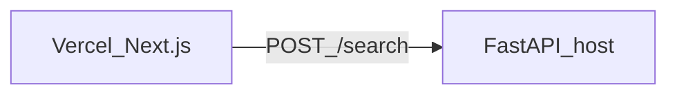

# Semantic search (portfolio stack)

Florida MLS listing descriptions → embeddings (sentence-transformers) → ChromaDB → **FastAPI**. A **Next.js** app on Vercel calls the API over HTTPS.

## Why two deployments?

Vercel runs the Next.js front end. **Chroma, PyTorch, and the embedding model do not run on Vercel serverless** in this setup. The Python API runs on any host that supports long-lived processes and enough RAM (Railway, Render, Fly.io, ECS, your laptop).



## Local development

### 1. Python dependencies

From repo root `machine_learning/`:

```bash
python -m pip install -r semantic_search/requirements.txt
```

### 2. Build the vector index (once, or after changing data/model)

```bash
python semantic_search/embed_listings.py --limit 200   # quick test
# or full dataset:
python semantic_search/embed_listings.py
```

This writes `semantic_search/chroma_data/`.

### 3. Run the API

```bash
cd /path/to/machine_learning
ALLOW_ORIGINS=http://localhost:3000 uvicorn semantic_search.server:app --reload --host 0.0.0.0 --port 8000
```

- `GET http://127.0.0.1:8000/health` — liveness and vector-store status  
- `POST http://127.0.0.1:8000/search` — JSON body `{"query":"...","k":5}`

### 4. Run the Next.js app

```bash
cd semantic_search/web
cp .env.local.example .env.local
npm install
npm run dev
```

Open [http://localhost:3000](http://localhost:3000). The default API URL in code is `http://127.0.0.1:8000`.

Shared search logic lives in `semantic_search/core.py`.

## Environment variables

- **FastAPI — `ALLOW_ORIGINS`:** comma-separated CORS origins, e.g. `http://localhost:3000,https://your-app.vercel.app`. Restart the API after changes.
- **FastAPI — `PORT`:** listen port; many hosts set this automatically (use `--port $PORT` in production).
- **Build / runtime — `HF_TOKEN` (optional):** Hugging Face token for higher rate limits when downloading model weights (set in your host’s env, not in git).
- **Next.js (`.env.local`) — `NEXT_PUBLIC_SEARCH_API_URL`:** API base URL, no trailing slash, e.g. `https://api.example.com`.
- **Vercel project settings — `NEXT_PUBLIC_SEARCH_API_URL`:** same value, pointing at your deployed FastAPI HTTPS URL.

## Deploy Next.js to Vercel

1. Connect the Git repo to Vercel.  
2. Set **Root Directory** to `semantic_search/web`.  
3. Add environment variable `NEXT_PUBLIC_SEARCH_API_URL` = your public API base URL.  
4. Deploy.

## Deploy the API (examples)

Pick any Python-capable host (Railway, Render, Fly.io, ECS/Fargate, EC2, etc.). Common pattern:

- From **repository root**:  
  `PYTHONPATH=. uvicorn semantic_search.server:app --host 0.0.0.0 --port ${PORT:-8000}`  
- **`chroma_data/`** is not committed to git. Generate it in CI, copy it into the image, or mount a volume — otherwise `/search` returns 503 until the index exists on the server.  
- Set **`ALLOW_ORIGINS`** to your Vercel URL(s).

## Project layout

- `constants.py` — paths, default model, collection name  
- `embed_listings.py` — CSV → embeddings → Chroma  
- `core.py` — shared `search_listings()`  
- `server.py` — FastAPI app  
- `web/` — Next.js (Vercel)  

## API shapes

**POST /search**

```json
{ "query": "pool renovated kitchen", "k": 5, "model_id": null }
```

**Response**

```json
{
  "results": [
    {
      "id": "row_0",
      "text": "...",
      "metadata": { "lastSoldPrice": 605000, "zip": "33446" },
      "distance": 0.12,
      "similarity": 0.88
    }
  ]
}
```
